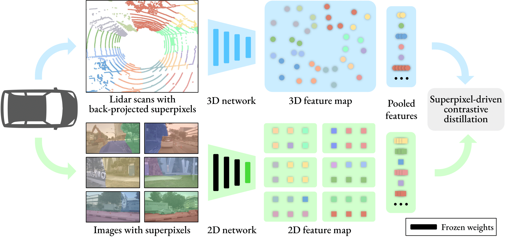

# Image-to-Lidar Self-Supervised Distillation for Autonomous Driving Data

Official PyTorch implementation of the method **SLidR**. More details can be found in the paper:

**Image-to-Lidar Self-Supervised Distillation for Autonomous Driving Data**, CVPR 2022 [[arXiv](https://arxiv.org/abs/2203.16258)]
by *Corentin Sautier, Gilles Puy, Spyros Gidaris, Alexandre Boulch, Andrei Bursuc, and Renaud Marlet*



If you use SLidR in your research, please consider citing:
```
@inproceedings{SLidR,
   title = {Image-to-Lidar Self-Supervised Distillation for Autonomous Driving Data},
   author = {Corentin Sautier and Gilles Puy and Spyros Gidaris and Alexandre Boulch and Andrei Bursuc and Renaud Marlet},
   booktitle = {Proceedings of the IEEE/CVF Conference on Computer Vision and Pattern Recognition (CVPR)},
   year = {2022}
}
```


## Dependencies

Please install the required required packages. Some libraries used in this project, including MinkowskiEngine and Pytorch-lightning are known to have a different behavior when using a different version; please use the exact versions specified in `requirements.txt`.


## Datasets

The code provided is compatible with [nuScenes](https://www.nuscenes.org/lidar-segmentation) and [semantic KITTI](http://www.semantic-kitti.org/tasks.html#semseg). Put the datasets you intend to use in the datasets folder (a symbolic link is accepted).


## Pre-trained models

### Minkowski SR-UNet
[SR-UNet pre-trained on nuScenes](https://github.com/valeoai/SLidR/releases/download/v1.0/minkunet_slidr_1gpu.pt)

### SPconv VoxelNet
[VoxelNet pre-trained on nuScenes](https://github.com/valeoai/SLidR/releases/download/v1.0/voxelnet_slidr.pt)

[PV-RCNN finetuned on KITTI](https://github.com/valeoai/SLidR/releases/download/v1.0/pvrcnn_slidr.pt)


## Reproducing the results

### Pre-computing the superpixels (required)

Before launching the pre-training, you first need to compute all superpixels on nuScenes, this can take several hours. You can either compute superpixels for the Minkowski SR-UNet (minkunet) or the voxelnet backbones. The first is adapted for semantic segmentation and the second for object detection.

```python superpixel_segmenter.py --model minkunet```

### Pre-training a 3D backbone

To launch a pre-training of the Minkowski SR-UNet (minkunet) on nuScenes:

```python pretrain.py --cfg config/slidr_minkunet.yaml```

You can alternatively replace minkunet with voxelnet to pre-train a PV-RCNN backbone.  
Weights of the pre-training can be found in the output folder, and can be re-used during a downstream task.

### Semantic segmentation

To launch a semantic segmentation, use the following command:

```python downstream.py --cfg_file="config/semseg_nuscenes.yaml" --pretraining_path="output/pretrain/[...]/model.pt"```

with the previously obtained weights, and any config file. The default config will perform a finetuning on 1% of nuScenes' training set, with the learning rates optimized for the provided pre-training.

To re-evaluate the score of any downstream network, run:

```python evaluate.py --resume_path="output/downstream/[...]/model.pt" --dataset="nuscenes"```

If you wish to reevaluate the linear probing, the experiments in the paper were obtained with `lr=0.05`, `lr_head=null` and `freeze_layers=True`.

### Object detection

All experiments for object detection have been done using [OpenPCDet](https://github.com/open-mmlab/OpenPCDet).


## Results
All results are obtained with a pre-training on nuScenes

### Few-shot semantic segmentation

#### Results on the validation set using Minkowski SR-Unet:
Method                                           |nuScenes<br />lin. probing|nuScenes<br />Finetuning with 1% data|KITTI<br />Finetuning with 1% data
---                                              |:-:                       |:-:                                  |:-:
Random init.                                     |8.1                       |30.3                                 |39.5
[PointContrast](https://arxiv.org/abs/2007.10985)|21.9                      |32.5                                 |41.1
[DepthContrast](https://arxiv.org/abs/2101.02691)|22.1                      |31.7                                 |41.5
[PPKT](https://arxiv.org/abs/2104.04687)         |36.4                      |37.8                                 |43.9
SLidR                                            |**38.8**                  |**38.3**                             |**44.6**

### Semantic Segmentation on nuScenes

#### Results on the validation set using Minkowski SR-Unet with a fraction of the training labels:
Method          |1%      |5%      |10%     |25%     |100%
---             |:-:     |:-:     |:-:     |:-:     |:-:
Random init.    |30.3    |47.7    |56.6    |64.8    |74.2
SLidR           |**39.0**|**52.2**|**58.8**|**66.2**|**74.6**

### Object detection on KITTI

#### Results on the validation set using Minkowski SR-Unet with a fraction of the training labels:
Method                                  |5%      |10%     |20%     
---                                     |:-:     |:-:     |:-:
Random init.                            |56.1    |59.1    |61.6
[PPKT](https://arxiv.org/abs/2104.04687)|**57.8**|60.1    |61.2
SLidR                                   |**57.8**|**61.4**|**62.4**

#### Results on the validation set using [PV-RCNN](https://arxiv.org/abs/1912.13192):
Method                                   |Car     |Pedestrian|Cyclist |mAP@40
---                                      |:-:     |:-:       |:-:     |:-:
Random init.                             |84.5    |**57.9**  |71.3    |71.3
[STRL](https://arxiv.org/abs/2109.00179)*|**84.7**|57.8      |71.9    |71.5
[PPKT](https://arxiv.org/abs/2104.04687) |83.2    |55.5      |73.8    |70.8
SLidR                                    |84.4    |57.3      |**74.2**|**71.9**

*STRL has been pre-trained on KITTI, while SLidR and PPKT were pre-trained on nuScenes

#### Results on the validation set using [SECOND](https://www.mdpi.com/1424-8220/18/10/3337):
Method                                          |Car     |Pedestrian|Cyclist |mAP@40
---                                             |:-:     |:-:       |:-:     |:-:
Random init.                                    |81.5    |50.9      |66.5    |66.3
[DeepCluster](https://arxiv.org/abs/1807.05520)*|        |          |        |66.1
SLidR                                           |81.9    |51.6      |68.5    |**67.3**

*As reimplemented in [ONCE](https://arxiv.org/abs/2106.11037)


## Acknowledgment

Part of the codebase has been adapted from [PointContrast](https://github.com/facebookresearch/PointContrast).
Computation of the lovasz loss used in semantic segmentation follows the code of [PolarNet](https://github.com/edwardzhou130/PolarSeg).

## License
SLidR is released under the [Apache 2.0 license](./LICENSE).
